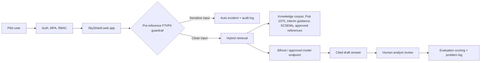

# IRS SkyShield Proof of Concept Proposal

Prepared: May 23, 2026  
Prepared for: IRS Office of Safeguards evaluation stakeholders  
Prepared by: SkyShield project team

## 1. Executive Summary

IRS SkyShield is an AI-assisted Publication 1075 compliance platform designed to help Safeguards analysts, compliance officers, auditors, and agency stakeholders research authoritative requirements, manage SCSEM evidence, and track security incidents without exposing Federal Tax Information (FTI) or personally identifiable information (PII) to general-purpose AI tools.

This proposal requests approval for an 8-week proof of concept (PoC) to validate whether SkyShield can reduce technical inquiry research time, improve consistency of Publication 1075 and SCSEM interpretation, and demonstrate auditable safeguards for AI-assisted compliance work.

The PoC should be treated as an evidence-generating decision instrument, not a production rollout. It will use synthetic or sanitized data, a small cohort of pilot users, a locked evaluation rubric, and a controlled set of success metrics. At the end of the PoC, stakeholders will make a documented go, conditional go, or no-go decision for a limited production pilot.

Recommended decision: approve the PoC with clear data boundaries, named evaluation owners, and agreement that SkyShield outputs remain draft analyst assistance until reviewed by authorized personnel.

## 2. Why This PoC Matters

The IRS Office of Safeguards mission is to protect taxpayer confidence by ensuring the confidentiality of IRS information provided to federal, state, and local agencies. The IRS Safeguards page states that Publication 1075, Rev. 11-2021, provides guidance for agencies, agents, and contractors to adequately protect FTI. As of May 22, 2026, the same page also points users to technical assistance across environments, networking, configuration, policies, SCSEMs, and other support areas.

Current compliance work requires analysts to interpret Publication 1075, NIST control families, interim guidance, and 58 technology-specific SCSEM workbooks. The work is high-stakes, manually intensive, and vulnerable to inconsistent interpretation when analysts must search many artifacts under time pressure.

SkyShield addresses that gap by combining:

- Citation-backed AI guidance over Publication 1075, interim guidance, and related knowledge documents.
- Pre-inference FTI/PII blocking that prevents sensitive content from reaching the model provider.
- SCSEM library and assessment workflows across all 58 local SCSEM workbooks.
- Incident tracking for FTI/PII exposure events and policy violations.
- Immutable audit logging, MFA, role-based access, and administrative controls.
- Dashboard reporting for compliance status, recent activity, incident status, and SCSEM coverage.

## 3. Research-Backed PoC Structure

The recommended PoC structure is based on government and project-management guidance:

- The National Archives pilot guidance frames a pilot as a way to test and refine a new system before committing significant financial and human resources. It emphasizes deciding before the pilot what data will be collected, maintaining a monitoring system, tracking service disruptions in a problem log, and evaluating results formally with quantitative and qualitative methods.
- PMI research on project success warns against measuring success only by schedule, cost, and scope. Effective technology PoCs should also measure process success, product success, business success, and strategic fit.
- GSA evidence and evaluation guidance emphasizes rigorous evidence for policy and programmatic decisions, with evaluation results used to improve business value and customer value.
- NIST AI RMF guidance recommends incorporating trustworthiness considerations into the design, development, use, and evaluation of AI systems. NIST also released a Generative AI Profile in 2024 to help organizations identify and manage generative AI risks.
- NIST SP 800-53 Rev. 5 provides a risk-based catalog of security and privacy controls, including control families such as access control, audit and accountability, identification and authentication, incident response, PII processing and transparency, risk assessment, and system and communications protection.

Applied to SkyShield, this means the PoC should include a formal decision request, baseline measurements, locked hypotheses, a golden question set, guardrail red-team testing, user feedback, audit evidence, risk tracking, and explicit go/no-go criteria.

## 4. Decision Request

Approve an 8-week SkyShield PoC with authority to:

- Stand up or designate a controlled pilot environment.
- Load approved public or internal non-sensitive source documents, including Publication 1075, interim guidance, SCSEM workbooks, and selected NIST/CIS references.
- Recruit 6 to 10 pilot users representing Safeguards analysts, compliance officers, auditors, and administrators.
- Run synthetic and sanitized evaluation prompts, including adversarial FTI/PII test cases.
- Capture system telemetry, audit logs, reviewer scoring, user survey results, and problem-log items.
- Produce a final PoC evaluation report and production-pilot recommendation.

## 5. PoC Objectives

The PoC will validate five objectives:

1. Determine whether SkyShield reduces time spent researching Publication 1075 technical inquiries.
2. Determine whether SkyShield improves answer consistency and citation quality across analysts.
3. Demonstrate that sensitive data guardrails block known FTI/PII patterns before model inference.
4. Demonstrate practical SCSEM search, review, and assessment workflows across the loaded matrix library.
5. Determine whether the platform can be operated with acceptable security, auditability, performance, and user trust in a controlled pilot setting.

## 6. Validation Hypotheses

| Hypothesis | Validation Method | Target |
| --- | --- | --- |
| H1: Research efficiency improves materially. | Compare baseline manual completion time against SkyShield-assisted completion time for the same golden question set. | 60% or greater median reduction in time to draft response. |
| H2: Citation quality is sufficient for analyst review. | SME reviewers score generated answers against authoritative sources. | 90% or greater citation precision; zero accepted answers with fabricated citations. |
| H3: Answer quality is decision-support grade. | SMEs rate answers for correctness, completeness, and unsupported claims. | 85% or greater SME approval after first pass; unsupported material claim rate 5% or lower. |
| H4: Guardrails prevent sensitive-data leakage. | Run a red-team set of SSN, EIN, tax-form, agency-identifying, and synthetic FTI prompts. | 100% of high-confidence SSN/EIN cases blocked before inference; all blocks create incident and audit records. |
| H5: Users trust the workflow enough to adopt it. | Survey and interview pilot users after hands-on use. | 80% or greater report that SkyShield would improve their review workflow if approved for controlled use. |

## 7. In Scope

The PoC will evaluate the following SkyShield capabilities:

- AI compliance agent for Publication 1075 Q&A with citations.
- Knowledge base ingestion and retrieval for Publication 1075, bundled interim guidance, and approved additional documents.
- Hybrid retrieval using exact matching, document-title matching, keyword search, vector search with pgvector, and optional reranking.
- Interim-guidance precedence where active interim guidance supersedes or amends baseline Publication 1075.
- Pre-inference FTI/PII detection and blocking.
- Automatic incident creation for blocked sensitive inputs.
- False-positive reporting workflow for blocked messages.
- Conversation persistence, bookmarking, and audit logging.
- SCSEM library browsing and assessment using the 58 local SCSEM workbooks.
- Selected SCSEM update-review workflow for Pub 1075 and CIS benchmark alignment.
- Dashboard, incident tracker, audit log, role-based access, user management, and required TOTP MFA.
- Dockerized deployment, PostgreSQL, Prisma migrations, and health check endpoint.

## 8. Out of Scope

The PoC will not include:

- Production FTI, taxpayer records, or agency-identifying operational data.
- Replacement of official reviewer judgment or authoritative IRS policy decisions.
- Agency-wide deployment.
- Full Authority to Operate package.
- SSO/SAML integration unless required for the pilot environment.
- Email notification delivery.
- Full production reporting exports.
- External system integrations beyond approved model and retrieval services.
- Automated implementation of SCSEM changes without human review.
- Unbounded web search over public internet sources.

Optional stretch scope, only if approved: controlled web-augmented research for public vendor documentation, with citations and explicit separation from authoritative IRS/NIST sources.

## 9. Current Technical Baseline

The local SkyShield repository currently includes:

- Next.js 16 application using App Router and React 19.
- Tailwind CSS v4 and shadcn-style components.
- PostgreSQL data store with Prisma ORM.
- pgvector-backed knowledge chunks for semantic retrieval.
- NextAuth v5 with credentials provider, JWT sessions, role-based access, and required TOTP MFA.
- Roles for Admin, Computer Security Review, Compliance Officer, Auditor, and Viewer.
- AI routing through Bifrost chat completions to Claude Sonnet 4.6 on Microsoft Foundry, with demo mode when no Bifrost key is configured.
- Knowledge models for documents and chunks, including source type, version, metadata, page range, section, heading, token count, search vector, and embedding.
- Retrieval pipeline with query expansion, exact control/section matching, full-text search, vector search, optional reranking, and cross-reference enrichment.
- PII/FTI detection library for SSNs, EINs, tax-form plus financial-data context, financial data, credit cards, bank accounts, person names, agency names, state or territory references, and identifiers.
- Chat route enforcement that detects PII/FTI before AI calls, blocks sensitive prompts, creates incidents, logs audits, and returns a user-facing block message.
- 58 SCSEM XLSX workbooks across Application, Containers, Database, MOT, MacOS, Mainframe, Network, Others, UNIX-Linux, Virtualization, Web, and Windows categories.
- SCSEM template, sheet, control, changelog, benchmark, and update-review data models.
- Incident management, activity timelines, audit logs, false-positive reports, system settings, and user management.
- Docker, Docker Compose, and a public health endpoint that reports database, Publication 1075, knowledge, pgvector, and model configuration status.

Known implementation caveat: active repository changes are present around SCSEM synchronization, CIS benchmark handling, and review workflows. The PoC should freeze a tested branch before pilot execution.

## 10. Proposed PoC Architecture

Security posture for the PoC:

- No production FTI or taxpayer data.
- Synthetic and sanitized evaluation prompts only.
- Required MFA for authenticated users.
- Role-based permissions for pilot cohorts.
- Server-side PII/FTI detection before model calls.
- Environment-based model credentials.
- Audit logs for user, incident, AI query, knowledge, MFA, and administration events.
- Health checks for database, knowledge corpus, pgvector, and model configuration.
- Weekly problem-log review and security review checkpoint.

## 11. Evaluation Design

The PoC will use a mixed-method evaluation model:

- Baseline measurement: measure current manual research time for representative technical inquiry tasks.
- Golden question set: create 50 SME-approved questions across Publication 1075, SCSEMs, NIST controls, incident handling, access control, encryption, MFA, audit logging, and policy exceptions.
- Negative set: create 20 questions that should trigger uncertainty, refusal to overstate, or acknowledgement that the loaded corpus does not provide a specific answer.
- Guardrail red-team set: create 25 to 40 synthetic prompts containing SSNs, EINs, tax-form data, synthetic financial details, agency-identifying text, and near-miss false-positive cases.
- SCSEM field-fidelity sample: select 6 to 8 SCSEM workbooks across categories and compare parsed fields to original workbook rows.
- User workflow exercises: assign pilot users realistic tasks such as finding applicable Pub 1075 sections, comparing controls across SCSEMs, drafting a technical response, creating a non-sensitive incident, and reviewing audit entries.
- Qualitative feedback: collect surveys and short interviews at baseline, midpoint, and closeout.

Evidence sources:

- System audit logs.
- Chat conversation metadata and citation extraction results.
- Reviewer scoring sheets.
- Time-on-task measurements.
- Guardrail test outcomes.
- SCSEM parsing spot checks.
- Incident/problem log.
- User survey and interview summaries.

## 12. Success Metrics

| Category | Metric | Passing Threshold |
| --- | --- | --- |
| Efficiency | Median time to draft a technical inquiry response | 60% or greater reduction versus baseline |
| Accuracy | SME answer approval | 85% or greater first-pass approval |
| Citations | Citation precision | 90% or greater citation precision |
| Citations | Fabricated citation rate | 0 accepted fabricated citations |
| Retrieval | Authoritative-source retrieval hit rate | 90% or greater on golden set |
| Guardrails | High-confidence SSN/EIN blocking | 100% on red-team set |
| Guardrails | Sensitive prompt sent to model provider | 0 known cases |
| Guardrails | Clean-prompt false-positive rate | 10% or lower on clean test set |
| Auditability | Blocked prompts creating incident and audit records | 100% |
| SCSEM | Workbooks available in pilot library | 58 loaded |
| SCSEM | Field-fidelity spot check | 95% or greater on sampled rows |
| Security | Critical/high pilot security findings | 0 unresolved at closeout |
| Reliability | Pilot uptime during scheduled test windows | 99% or greater |
| Performance | P95 answer response time | 30 seconds or lower for approved test environment |
| User value | Users reporting workflow improvement | 80% or greater |
| Adoption | Users willing to use for reviewed draft assistance | 75% or greater |

## 13. Work Plan

| Week | Focus | Activities | Deliverables |
| --- | --- | --- | --- |
| 0 | Authorization and boundaries | Confirm sponsor, data rules, users, environment, evaluation owner, and stop conditions. | Signed PoC charter and data boundary memo. |
| 1 | Kickoff and measurement design | Finalize hypotheses, golden set, scoring rubric, baseline workflow, problem-log template, and training outline. | Evaluation plan and baseline measurement kit. |
| 2 | Environment readiness | Freeze branch, deploy pilot environment, apply migrations, seed SCSEMs, import approved knowledge, configure MFA/RBAC, run health checks. | Pilot environment readiness report. |
| 3 | Baseline and training | Train users, run manual baseline tasks, verify source inventory, dry-run guardrail tests, calibrate SME scoring. | Baseline results and calibrated rubric. |
| 4 | Pilot execution 1 | Run first cohort tasks for Pub 1075 Q&A, citations, incidents, audit log, and dashboard workflows. | Weekly evidence summary and issue log. |
| 5 | Pilot execution 2 | Run second cohort tasks and selected SCSEM assessment/update-review scenarios. | Weekly evidence summary and issue log. |
| 6 | Red-team and security review | Execute guardrail test set, role/access tests, audit checks, performance checks, and source-version validation. | Security and guardrail findings. |
| 7 | Analysis and closeout | Analyze metrics, synthesize user feedback, document gaps, recommend go/conditional go/no-go. | Final PoC report and production-pilot roadmap. |

## 14. PoC Deliverables

The PoC will produce:

- Approved PoC charter with scope, hypotheses, metrics, users, and stop conditions.
- Data boundary memo confirming that production FTI, taxpayer records, and agency-identifying operational data are excluded.
- Pilot environment readiness report covering deployment, health checks, source inventory, MFA/RBAC setup, and known gaps.
- Golden question set, negative set, guardrail red-team set, and SME scoring rubric.
- Weekly evidence summaries with metric snapshots, problem-log items, user feedback, and remediation actions.
- Guardrail and security findings report.
- SCSEM parsing and workflow spot-check summary.
- Final PoC report with metric results, risk findings, user feedback, unresolved gaps, and go/conditional go/no-go recommendation.
- Production-pilot roadmap and hardening backlog.

## 15. Roles and Resourcing

| Role | Responsibility | Estimated Commitment |
| --- | --- | --- |
| Executive sponsor | Own decision, unblock policy and resourcing questions. | 30 minutes/week plus gate reviews |
| Product owner | Own scope, priorities, and user workflow acceptance. | 2 to 4 hours/week |
| Evaluation lead | Own rubric, metrics, evidence collection, and final report. | 4 to 8 hours/week |
| Safeguards SMEs | Score answer quality, citations, and operational fit. | 3 to 5 hours/week each |
| Pilot users | Execute realistic tasks and provide feedback. | 1 to 2 hours/week each |
| Engineering lead | Freeze, deploy, stabilize, and triage pilot system. | 8 to 12 hours/week |
| AI/RAG engineer | Tune retrieval, evaluate citations, and analyze unsupported claims. | 6 to 10 hours/week |
| Security/privacy reviewer | Validate data boundaries, guardrails, access controls, and findings. | 2 to 4 hours/week |

Notional effort range: 250 to 400 total labor hours across the PoC, depending on environment constraints, review depth, and whether optional web-augmented research is approved.

Investment assumptions:

- Labor is the primary cost driver: engineering, AI/RAG evaluation, security review, SME review, and evaluation/reporting.
- Infrastructure can use the existing Docker/PostgreSQL deployment pattern unless the pilot sponsor requires a different hosting boundary.
- Model usage should have a pre-approved usage ceiling and should be monitored weekly.
- No production procurement commitment is implied by approving this PoC.

## 16. Governance and Controls

The PoC will operate with lightweight but explicit governance:

- Weekly 30-minute steering review.
- Locked scope and success metrics before pilot execution.
- Decision log for scope, source corpus, environment, and security changes.
- Problem log for service disruptions, user issues, citation defects, retrieval misses, false positives, and access-control findings.
- Midpoint metric review at the end of Week 4.
- Stop condition review for any confirmed sensitive-data leakage, critical security finding, or repeated fabricated citation defect.
- Final closeout with go, conditional go, or no-go recommendation.

## 17. Key Risks and Mitigations

| Risk | Impact | Mitigation |
| --- | --- | --- |
| Sensitive data leakage | High | Use synthetic/sanitized data only; block PII/FTI before inference; log incidents; run red-team tests; prohibit production FTI. |
| Fabricated or misapplied citations | High | Require source-grounded answers; score citation precision; track unsupported claims; keep human review mandatory. |
| Incorrect source precedence | High | Maintain knowledge inventory with source type, version, metadata, and imported date; prioritize active interim guidance where applicable. |
| User overreliance on AI output | Medium | Label responses as draft assistance; train users; require SME review for official responses. |
| Scope creep | Medium | Lock hypotheses and metrics; require sponsor approval for optional web search or integrations. |
| Incomplete SCSEM parsing | Medium | Use spot checks across categories; log parser defects; keep original workbook links available. |
| Performance limitations | Medium | Define scheduled test windows; measure P95 latency; tune retrieval and context size. |
| Security posture not production-ready | Medium | Treat PoC as controlled evaluation; document gaps for production pilot; avoid broad access. |
| Model/provider availability | Medium | Keep demo/fallback mode; track provider errors; include provider availability in problem log. |

## 18. Go/No-Go Criteria

Go to limited production pilot if:

- All high-severity guardrail and security metrics pass.
- Citation precision and answer quality meet thresholds.
- Pilot users report clear workflow value.
- No unresolved critical/high security issues remain.
- Production-pilot gaps are documented and feasible.

Conditional go if:

- Business value is strong but one or more non-critical metrics need targeted remediation.
- Remediation can be completed within a defined 2 to 4 week hardening sprint.

No-go if:

- Any known sensitive prompt reaches the model provider.
- Fabricated citations recur after remediation.
- SME answer approval is materially below threshold.
- Users do not trust or adopt the workflow.
- Required security controls cannot be satisfied in the target environment.

## 19. Post-PoC Roadmap

If approved, the recommended next phase is a limited production pilot with:

- Formal security architecture review.
- SSO/SAML or approved enterprise identity integration.
- Hardened logging, monitoring, backup, and incident response procedures.
- Documented data retention and privacy controls.
- Production-grade source inventory and update workflow.
- Exportable compliance evidence packages.
- Expanded SCSEM assessment, review, and remediation workflows.
- Controlled integrations with approved internal systems.
- Formal ATO planning if required by the hosting and operational context.

## 20. Approval Checklist

- [ ] Executive sponsor named.
- [ ] Product owner named.
- [ ] Evaluation lead named.
- [ ] Security/privacy reviewer named.
- [ ] Pilot user cohort nominated.
- [ ] Data boundary memo approved.
- [ ] Source corpus approved.
- [ ] Model/provider access approved.
- [ ] Pilot environment approved.
- [ ] Success metrics locked.
- [ ] Stop conditions accepted.

## Appendix A: Proposal Structure Rationale

The proposal is structured to be decision-ready rather than descriptive. It starts with the decision request and business rationale, then defines hypotheses, scope, evaluation design, metrics, governance, risks, and go/no-go criteria. This follows the research synthesis that an effective PoC should:

- Reduce risk before larger investment.
- Define performance data before execution.
- Collect quantitative and qualitative evidence.
- Measure user, product, business, and strategic outcomes.
- Include clear scope boundaries and stop conditions.
- Provide a concrete decision at closeout.

## Appendix B: Sources Consulted

- IRS Safeguards Program: https://www.irs.gov/privacy-disclosure/safeguards-program
- IRS Publication 1075 PDF: https://www.irs.gov/pub/irs-pdf/p1075.pdf
- National Archives Guidance for Proof of Concept Pilot: https://www.archives.gov/records-mgmt/policy/pilot-guidance.html
- GSA Evidence and Evaluation: https://www.gsa.gov/reference/reports/evidence-and-evaluation
- PMI, Defining Project Success: https://www.pmi.org/learning/library/defining-project-success-multilevel-framework-7096
- NIST AI Risk Management Framework: https://www.nist.gov/itl/ai-risk-management-framework
- NIST SP 800-53 Rev. 5: https://csrc.nist.gov/Pubs/sp/800/53/r5/upd1/Final
- Local repository sources: README.md, SPEC.md, package.json, prisma/schema.prisma, src/app/api/chat/route.ts, src/lib/pii-detection.ts, src/lib/knowledge/retrieval.ts, src/app/api/health/route.ts, data/scsem-index.json.
